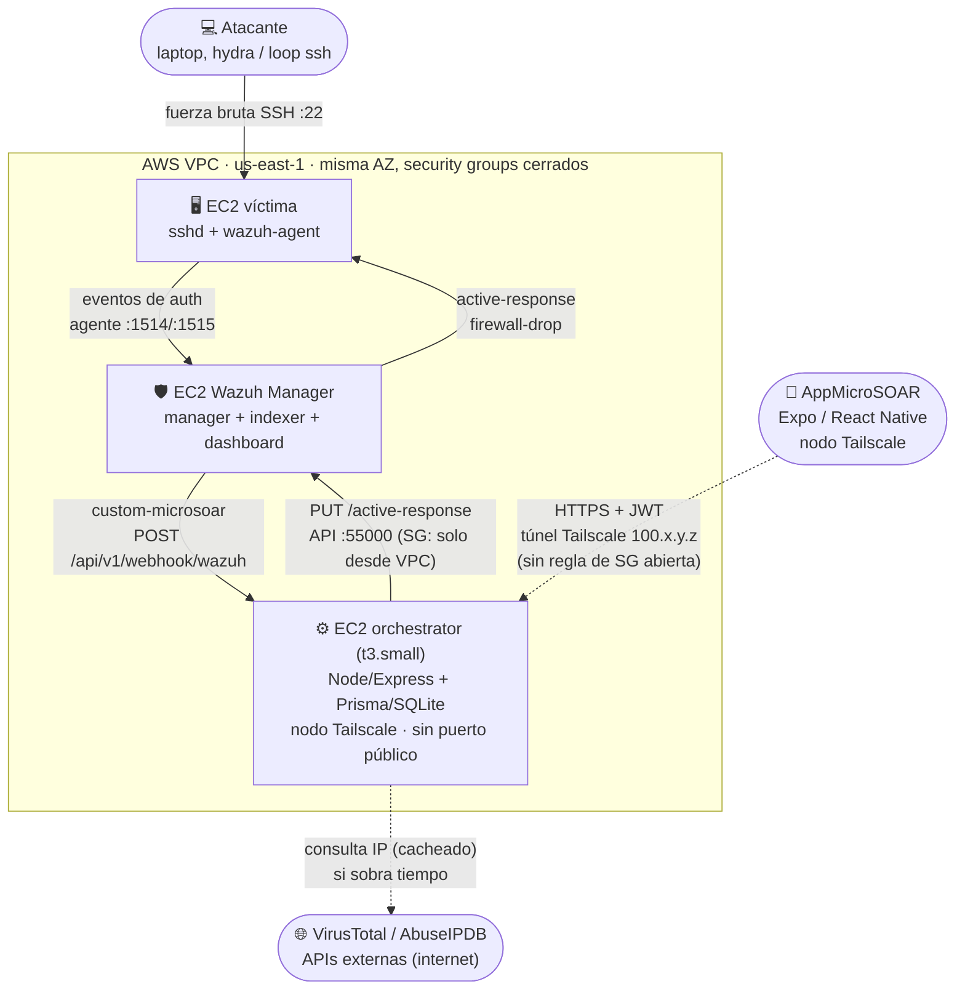
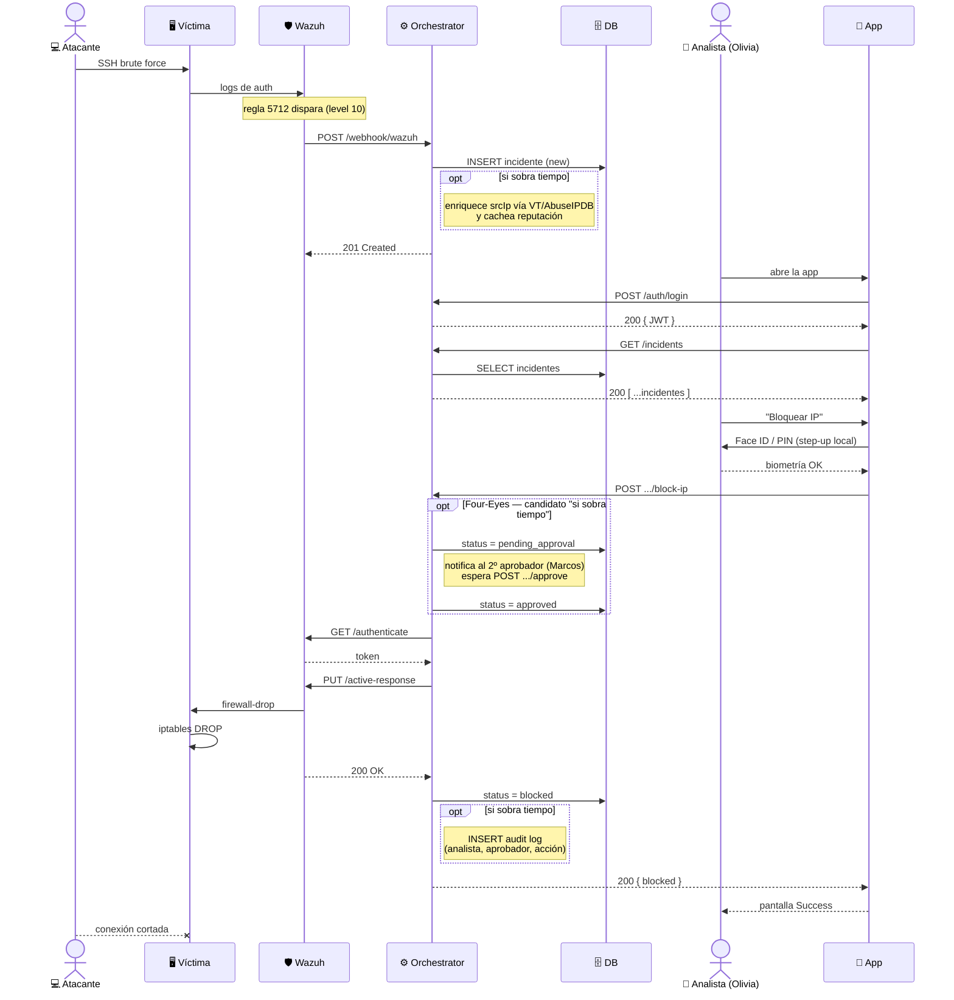
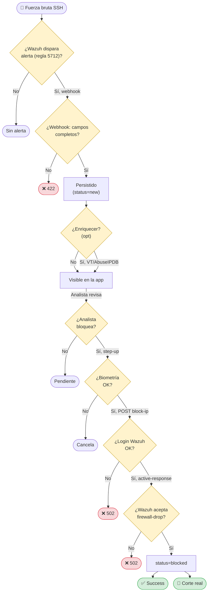
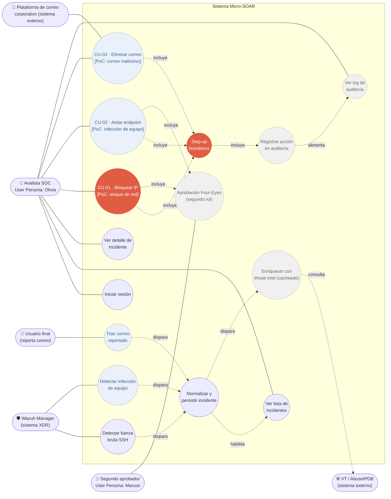
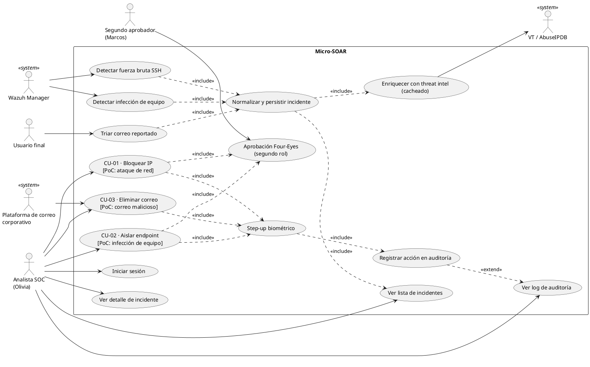
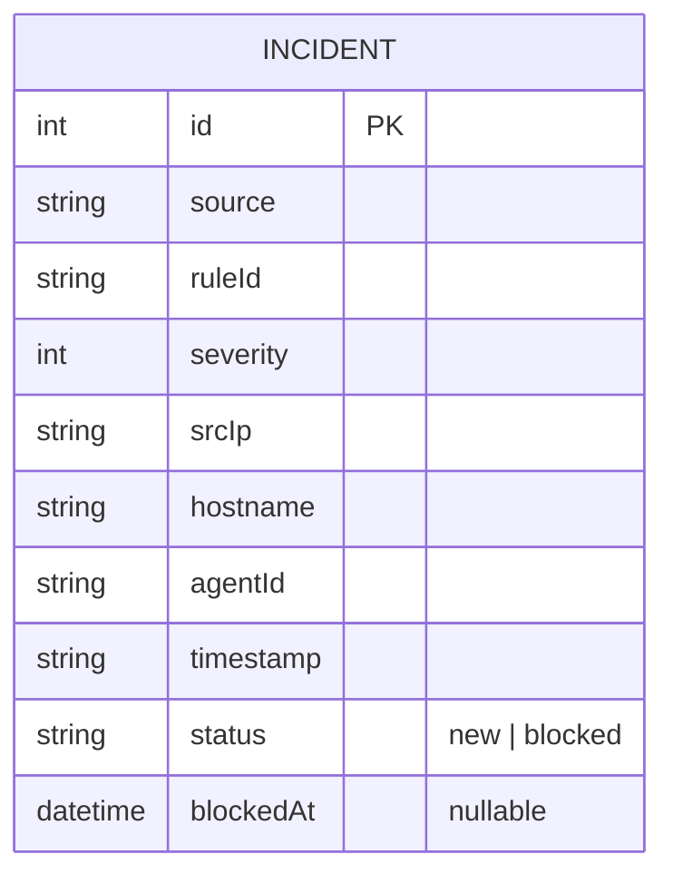
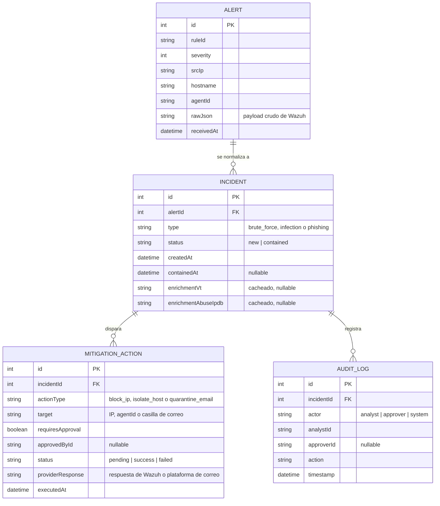
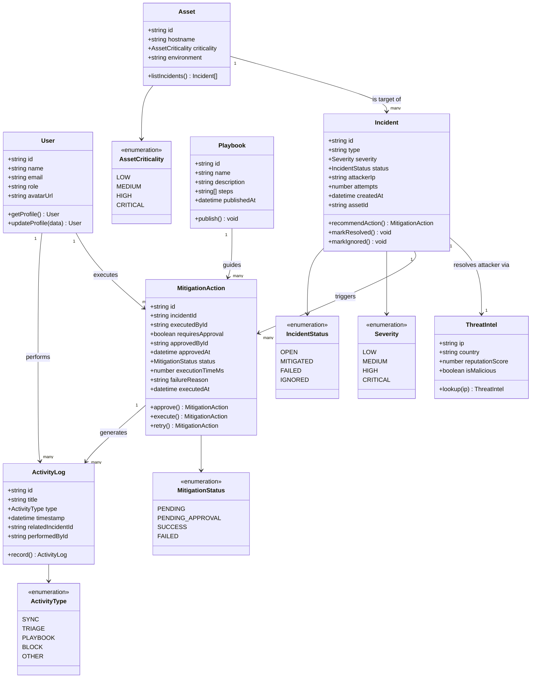

<!-- title: Micro-SOAR — Diagramas de Arquitectura -->

# Micro-SOAR — Diagramas de Arquitectura

Los diagramas que pediste, en Mermaid, armados a partir del código real del repo (`orchestrator/`, `AppMicroSOAR/`, `terraform/`) y de `PLAN.md`, no de una plantilla genérica. Cada sección tiene el código para copiar y una nota corta de qué decisión de diseño encierra.

> **Contexto clave (2026-08-16):** el 18/08 es un **checkpoint intermedio
> ("MVP 50%")**, no la entrega final del PFI. Por eso, a partir de la
> sección 4, varios diagramas distinguen tres niveles de alcance —
> 🔴 meta garantizada de este checkpoint, ⚪ candidato "si sobra tiempo"
> dentro del mismo checkpoint, 🔵 producto final (fuera de este checkpoint)
> — en vez de solo "implementado vs. resto de la propuesta". Los 3 casos de
> uso completos (CU-01/02/03, con Four-Eyes y flujos alternativos) están
> detallados en `TESIS_CAPITULOS.md`, capítulo 6.

| # | Diagrama | Responde a |
|---|---|---|
| 1 | Arquitectura de despliegue | ¿Dónde vive cada componente y cómo se hablan? |
| 2 | Secuencia | ¿Qué pasa, en orden, desde el ataque hasta el bloqueo? |
| 3 | Diagrama de flujo | ¿Qué decisiones y ramas de error tiene el proceso, de punta a punta? |
| 4 | Casos de uso | ¿Qué dispara el analista a mano vs. qué resuelve el sistema solo? |
| 5 | Entidad-Relación | ¿Cómo es la base hoy, y cómo escala si sobra tiempo? |
| 6 | Modelo de dominio objetivo | ¿Hacia dónde escala esto como trabajo futuro? |

---

## 1. Arquitectura de despliegue (alto nivel)

**Qué decisión encierra este dibujo:** la flecha punteada del celular al orchestrator es la única forma de llegar a la API — no hay ningún puerto 8000 abierto en el security group (ver `terraform/main.tf`, `aws_security_group.orchestrator`), ni siquiera a tu IP. Ese es el argumento Zero Trust de la tesis: el backend del SOAR nunca está expuesto a `0.0.0.0/0`, solo es alcanzable dentro de la tailnet cifrada. La única flecha "abierta al mundo" del lado defensivo es la del orchestrator hacia VT/AbuseIPDB (saliente, cacheada, ítem "si sobra tiempo" de `PLAN.md`); la única flecha "abierta al mundo" del lado ofensivo es la del atacante contra la víctima, que es justamente la que se quiere cortar.

*Fuente: `terraform/main.tf` (security groups), `orchestrator/integrations/custom-microsoar.py` (webhook), `orchestrator/src/wazuh.js` (llamada a la API de Wazuh), `PLAN.md` sección 4 (enriquecimiento VT/AbuseIPDB).*

---

## 2. Secuencia (el core business)

> **Actualización (2026-08-16):** se agregó el bloque `opt` de Four-Eyes
> (candidato "si sobra tiempo" dentro del checkpoint del 18/08, igual que
> enriquecimiento y audit log) para que este diagrama quede consistente con
> los 3 niveles de alcance de la sección 4. El flujo completo de aprobación,
> con escalamiento por SLA (FA-1) y excepción por incidente crítico (FA-2),
> está en `TESIS_CAPITULOS.md` capítulo 6, sección 6.5 — acá se muestra solo
> el camino feliz de Four-Eyes.

**Qué decisión encierra este dibujo:** el step-up biométrico (`App→Analyst→App`) pasa *antes* de la llamada de red al orchestrator, no después — es local al dispositivo, no un segundo POST. Y el tiempo que se muestra en "Success" (ver `AppMicroSOAR/app/loading.tsx`) se mide justo entre el POST de bloqueo y la respuesta 200: es el número real que reemplaza a los 8–14 minutos del flujo tradicional. Los tres bloques `opt` (enriquecimiento, Four-Eyes, audit log) están marcados como opcionales a propósito: son candidatos "si sobra tiempo" dentro del checkpoint, no el camino feliz mínimo garantizado — si los tres se recortan, el resto del diagrama no cambia. Notar que si Four-Eyes se implementa, el `POST .../block-ip` ya no ejecuta el bloqueo directamente: solo lo solicita — la ejecución real queda condicionada a la aprobación del segundo rol. *(Versión compactada 2026-08-16 para entrar en A4: de 10 a 7 participantes — se sacaron las columnas dedicadas a threat intel y al segundo aprobador, reemplazadas por `Note` sobre el Orchestrator; también se sacó del diagrama el flujo "ver auditoría" (`GET /audit`), que es un flujo de consulta separado y no forma parte del hilo dorado. El contenido lógico es el mismo, solo cambió cómo se muestra.)*

*Fuente: `orchestrator/src/app.js`, `orchestrator/src/normalize.js`, `orchestrator/src/wazuh.js`, `AppMicroSOAR/app/{index,auth,confirm,loading,success,activity}.tsx`, `PLAN.md` sección 4 y 7 (contrato `GET /api/v1/audit`, enrichment), `TESIS_CAPITULOS.md` capítulo 6 sección 6.5 (flujo Four-Eyes de CU-01, provisto por el equipo el 2026-08-16).*

---

## 3. Diagrama de flujo (proceso de punta a punta, con ramas de error)

A diferencia del diagrama de secuencia (sección 2), que muestra el intercambio de mensajes entre componentes, este muestra el *proceso* como lo vería un analista: decisiones y qué pasa cuando algo sale mal. Las ramas de error no son hipotéticas — cada una corresponde a un código de estado real que devuelve `orchestrator/src/app.js`.

**Por qué este diagrama no incluye Four-Eyes (a diferencia de las secciones 2 y 4):** acá cada rama roja está atada a un código HTTP que el código realmente devuelve hoy. Como Four-Eyes es todavía un candidato "si sobra tiempo" y no existe ningún endpoint de aprobación implementado, dibujar una rama de decisión para eso sería inventar un código que no existe — rompería la garantía de "esto no es hipotético" que sostiene el resto del diagrama. Si se implementa Four-Eyes, la actualización correcta acá es agregar `D-approval: "¿segundo aprobador aprueba?"` entre el `POST /:id/actions/block-ip` y el login contra Wazuh, con su propia rama de error (posible `202 Accepted, pending_approval` en vez de ejecutar directo) — pero eso se agrega cuando haya código real detrás, no antes.

**Qué decisión encierra este dibujo:** hay tres ramas rojas (422 por alerta inválida, 502 por login de Wazuh rechazado, 502 por comando de bloqueo rechazado) y todas están implementadas hoy — no son un "qué pasaría si", `orchestrator/src/app.js` las devuelve tal cual. Ninguna rama roja rompe el sistema: en el peor caso el incidente se queda en `status = new` y el analista puede reintentar. La única decisión que queda 100% del lado humano es D4 ("¿bloquear?") — todo lo anterior es automático y todo lo posterior es step-up + verificación contra la API real de Wazuh, no un mock. *(Versión compactada 2026-08-16 para entrar en una página A4: los nombres de endpoints y el detalle de cada código quedaron en las etiquetas de las flechas y en este párrafo en vez de en cada nodo — el contenido lógico es idéntico a la versión anterior, ver historial de `DIAGRAMAS.md` si hace falta la variante expandida.)*

*Fuente: `orchestrator/src/app.js` (respuestas 201/422/502), `orchestrator/src/normalize.js` (validación de campos), `orchestrator/src/wazuh.js` (validación de `error`/`failed_items`), `AppMicroSOAR/app/{confirm,loading,success}.tsx` (step-up y pantalla final), `PLAN.md` sección 2 (hilo dorado).*

---

## 4. Casos de uso

Mermaid no tiene un tipo de diagrama UML de casos de uso nativo (sin actores "monigote" ni óvalos reales), así que esta versión lo aproxima con un flowchart. Si tu entrega necesita la notación UML formal, más abajo dejo el mismo diagrama en PlantUML, que sí soporta `usecase` y `actor` de verdad.

> **Actualización (2026-08-16):** el 18/08 es un **checkpoint intermedio
> ("MVP 50%")**, no la entrega final del PFI — el producto final (más
> adelante en la cursada) sí compromete los 3 CU completos, incluyendo
> Four-Eyes. Este diagrama ahora distingue **tres** niveles de alcance en
> vez de dos, para no confundir "qué entra en este checkpoint" con "qué es
> el diseño objetivo final". Los flujos completos con precondición/
> postcondición/flujos alternativos (FA-1 a FA-7) de cada CU, incluyendo
> Four-Eyes y las excepciones, están documentados en `TESIS_CAPITULOS.md`,
> capítulo 6, sección 6.5 — este diagrama muestra la estructura de actores y
> dependencias, no el detalle de cada flujo alternativo.

Esta versión organiza los 3 casos de uso críticos alrededor de los 3 PoC que la propuesta compromete en la sección 2.3 ("Alcance"): **CU-01** (ataque de red / fuerza bruta), **CU-02** (infección de equipo) y **CU-03** (correos maliciosos reportados). Los tres comparten step-up biométrico; CU-01 y CU-02 además requieren aprobación de un segundo rol (Four-Eyes) — CU-03 deliberadamente no, por tratarse de una acción reversible y de bajo impacto operativo.

**Tres niveles de alcance, no dos:**
- 🔴 **Rojo sólido — meta garantizada de este checkpoint (18/08):** login, listar, ver detalle, step-up biométrico, y CU-01 (bloqueo de IP) sin Four-Eyes ni enriquecimiento. Es la Prioridad 1 acordada: cerrar el hilo dorado de punta a punta contra infraestructura real.
- ⚪ **Gris punteado — candidato "si sobra tiempo" dentro de este checkpoint:** enriquecimiento con threat intel, audit log, y una versión mínima de Four-Eyes acotada a CU-01. Ninguno es parte de la meta garantizada; se suman solo si el hilo dorado cierra con margen.
- 🔵 **Azul punteado — producto final, explícitamente fuera de este checkpoint:** CU-02 completo, CU-03 completo, y sus respectivas fuentes de detección/reporte. No se intentan ahora porque cada uno arrastra incertidumbre técnica propia sin resolver (aislamiento de endpoint necesita su propio "spike" tipo Fase 0; phishing necesita integrar un gateway de correo que hoy no existe en absoluto en la infraestructura) — quedan como diseño completo y validado, no como código.

### Versión Mermaid (aproximada)

**Qué decisión encierra este dibujo:** `FourEyes` es un `<<include>>` de CU-01 y CU-02, pero deliberadamente **no** de CU-03 — es la asimetría real de la especificación (CU-03 es "reversible y de bajo impacto operativo", no la requiere). Y a diferencia de la versión anterior de este diagrama (que solo distinguía "implementado" vs. "resto de la propuesta"), ahora hay tres niveles: lo rojo es lo único que este checkpoint garantiza; lo gris es candidato oportunista dentro del mismo checkpoint; lo azul es explícitamente otro hito, más adelante. Esta distinción evita el error de que el jurado del checkpoint intermedio interprete el diagrama como "esto es lo que falta para el 18/08" cuando en realidad CU-02/CU-03 son alcance de una entrega posterior.

**Nota de brecha en el análisis de requerimientos:** ninguna de las 19 Historias de Usuario relevadas en el User Research (propuesta, sección 3.3.3.4) menciona correo o phishing — CU-03 no tiene una HU que lo respalde. Vale la pena decidir conscientemente si eso se agrega como HU-20 antes de la entrega final, o si se documenta como una limitación reconocida del relevamiento.

### Versión PlantUML (notación UML formal)

*Leyenda de color aplicable a ambas versiones: 🔴 rojo = meta garantizada del checkpoint 18/08 · ⚪ gris punteado = candidato "si sobra tiempo" dentro del checkpoint · 🔵 azul punteado = producto final, fuera de este checkpoint.*

*Fuente: propuesta sección 2.3 ("Alcance" — 3 PoC: fuerza bruta, infección de equipo, correos maliciosos), `PLAN.md` secciones 1, 4 y 7 (guion de 5 min, "Fuera del MVP", contrato `GET /api/v1/audit`), `AppMicroSOAR/app/auth.tsx` (step-up real con `expo-local-authentication`), `AppMicroSOAR/app/activity.tsx` (audit log en la app), `TESIS_CAPITULOS.md` capítulo 6 sección 6.5 (flujos completos de CU-01/02/03 con precondiciones, Four-Eyes y flujos alternativos FA-1 a FA-7, provistos por el equipo el 2026-08-16).*

---

## 5. Modelo Entidad-Relación (DER)

Ojo con este: hoy la base **no** tiene tablas separadas de alertas, reglas de bloqueo y auditoría — todo vive en una sola tabla `incidents` (ver `orchestrator/prisma/schema.prisma`). Te dejo las dos versiones para que no la tesis no diga algo que el código no hace:

### DER actual (lo que está implementado)

Una sola entidad: el orchestrator normaliza la alerta cruda de Wazuh directamente a `Incident` y la persiste ahí (`normalizeWazuhAlert()`), sin guardar la alerta original ni un log de auditoría separado.

### DER extendido (roadmap — PLAN.md sección 9, no implementado)

**Qué decisión encierra este dibujo (versión generalizada a los 3 CU, 2026-08-16):** `MITIGATION_ACTION` reemplaza a `BLOCK_ACTION` como entidad única para las 3 acciones de contención (`block_ip`, `isolate_host`, `quarantine_email`) — es el mismo criterio de "interfaz común" que ya tenía `MitigationAction` en la sección 6, ahora reflejado también a nivel de esquema. `INCIDENT.type` se agrega por el mismo motivo: sin él no habría forma de saber qué acciones ofrecerle al analista para un incidente dado.

Tres ajustes de consistencia respecto a la primera versión de este diagrama:
- `AUDIT_LOG` mantiene `analystId`/`approverId` (no solo el rol genérico `actor`) para respaldar la postcondición de CU-01 tal como está escrita en `TESIS_CAPITULOS.md` capítulo 6 ("queda registrada... con analista, aprobador, timestamp"). Quedan afuera `deviceId`/`sourceIp` a propósito — son detalle forense de "si sobra tiempo", no lo mínimo para que el audit log cumpla su función.
- `INCIDENT.status` **no** incluye `failed` — queda `new | contained`, consistente con el diagrama de flujo (sección 3) y su propia regla ya documentada: un intento de mitigación fallido no es terminal, el incidente vuelve a `new` y se puede reintentar. `failed` vive únicamente en `MITIGATION_ACTION.status`, por intento — si en algún momento se define una regla de "abandonar después de N intentos", ahí sí correspondería agregar un estado terminal a `INCIDENT`, pero esa regla todavía no existe.
- `MITIGATION_ACTION.status` quedó con 3 valores (`pending | success | failed`) en vez de distinguir explícitamente "pendiente de aprobación" de "pendiente de ejecución" — la distinción se infiere de `requiresApproval` + `approvedById` (nulo = todavía no aprobado) en vez de un cuarto valor de enum. Es más liviano que el `MitigationStatus` de la sección 6 (que sí tiene `PENDING_APPROVAL` como estado propio) a propósito: esta sección es el roadmap más simple, la sección 6 es el modelo de dominio completo.

Nota menor: `agentId` no vive en `MITIGATION_ACTION` — para `block_ip`/`isolate_host` se obtiene vía `INCIDENT → ALERT.agentId`, no se duplica en cada intento. Y ni `analystId`/`approverId` son FK reales todavía: este DER no modela una entidad `USER` (a propósito, sigue siendo más angosto que la sección 6).

*Fuente: `orchestrator/prisma/schema.prisma`, `PLAN.md` sección 9 ("Diseño para escalar"), `TESIS_CAPITULOS.md` capítulo 6 sección 6.5 (postcondiciones de CU-01/02/03, versión generalizada a los 3 CU provista por el equipo el 2026-08-16).*

---

## 6. Modelo de dominio objetivo (class diagram — trabajo futuro, no implementado)

Este es un modelo de dominio más completo que el DER roadmap de la sección 5: agrega `User`, `Asset` y `Playbook` como entidades propias, separa el enriquecimiento en `ThreatIntel`, y le suma a `MitigationAction` reintentos, motivo de fallo, y los campos de Four-Eyes (`requiresApproval`/`approvedById`/`approvedAt`) que el DER de la sección 5 ya modela de forma más liviana en `MITIGATION_ACTION`. Es el "hacia dónde escala esto" para la sección de trabajo futuro de la tesis — **nada de esto está implementado** ni entra en el checkpoint del 18/08 (ver `PLAN.md` sección 4, "Fuera del MVP").

**Cómo se relaciona con lo que ya existe:**
- `Incident` (con `Severity`/`IncidentStatus`) es la evolución natural de la tabla `INCIDENT` de hoy — hoy `severity` es un `int` crudo de Wazuh y `status` es un string libre (`"new" | "blocked"`), acá quedarían como enums propios.
- `MitigationAction` reemplaza al `BLOCK_ACTION` del DER roadmap, agregando reintentos (`retry()`) y motivo de fallo — cosas que hoy `orchestrator/src/wazuh.js` no modela (si el bloqueo falla, solo se propaga un error 502, no se persiste el intento). Los campos `requiresApproval`/`approvedById`/`approvedAt` (agregados 2026-08-16) modelan Four-Eyes a nivel de dominio: `requiresApproval = true` para CU-01 y CU-02, `false` para CU-03 — es la misma asimetría que ya está en el diagrama de casos de uso (sección 4), acá expresada como dato en vez de como estructura del diagrama.
- `ThreatIntel` es la contraparte de "Enriquecimiento VT/AbuseIPDB cacheado" (`PLAN.md` sección 4, "si sobra tiempo").
- `ActivityLog` es el mismo concepto que `AUDIT_LOG` en el DER roadmap.
- `User`, `Asset` y `Playbook` son los tres conceptos genuinamente nuevos frente a todo lo documentado hasta ahora: no tienen equivalente ni en el código ni en el roadmap de `PLAN.md`. Son los que más rediseño de API y de app implicarían si algún día se implementan (login pasaría de env vars a tabla `User`, el bloqueo pasaría de "un endpoint" a "ejecutar un `Playbook`").

*Fuente: diagrama provisto por el usuario, contrastado contra `orchestrator/prisma/schema.prisma`, `orchestrator/src/{app,wazuh,auth}.js`, `PLAN.md` secciones 4 y 9.*