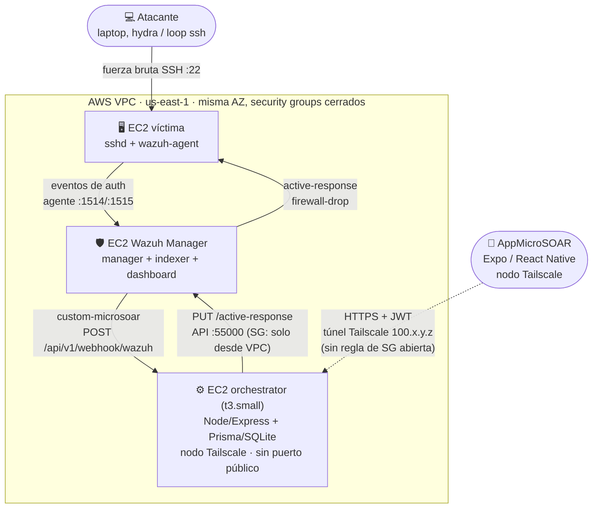
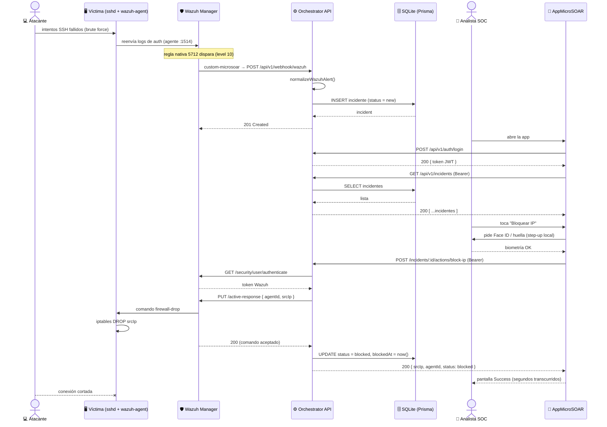
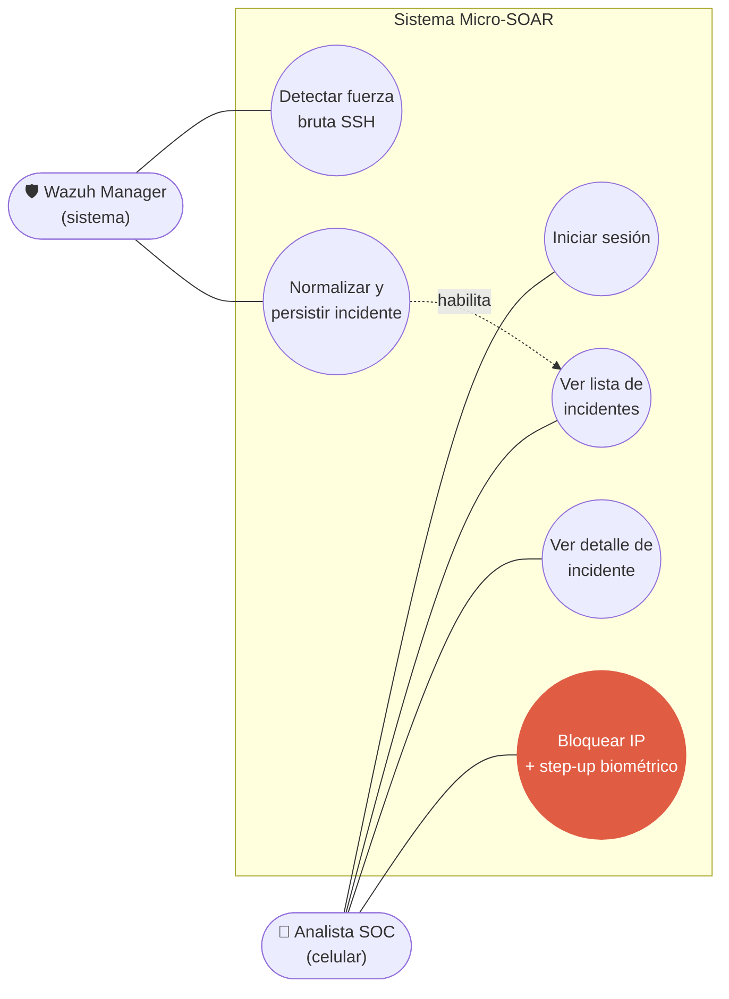
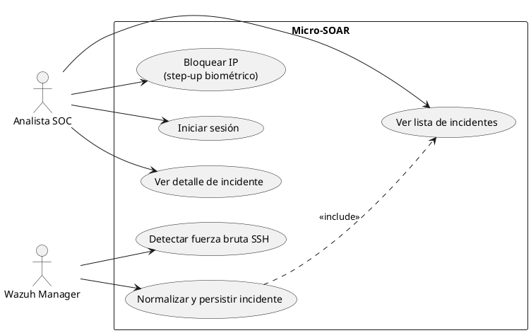
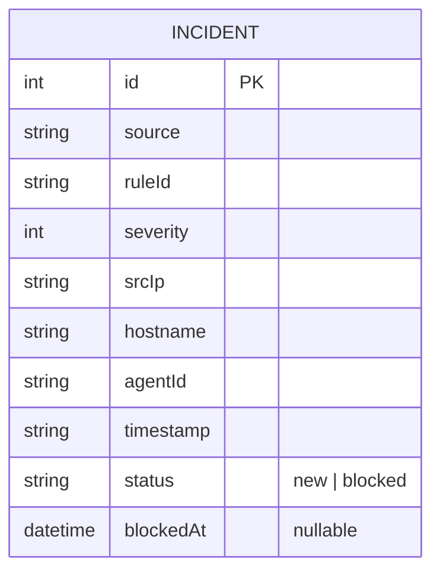
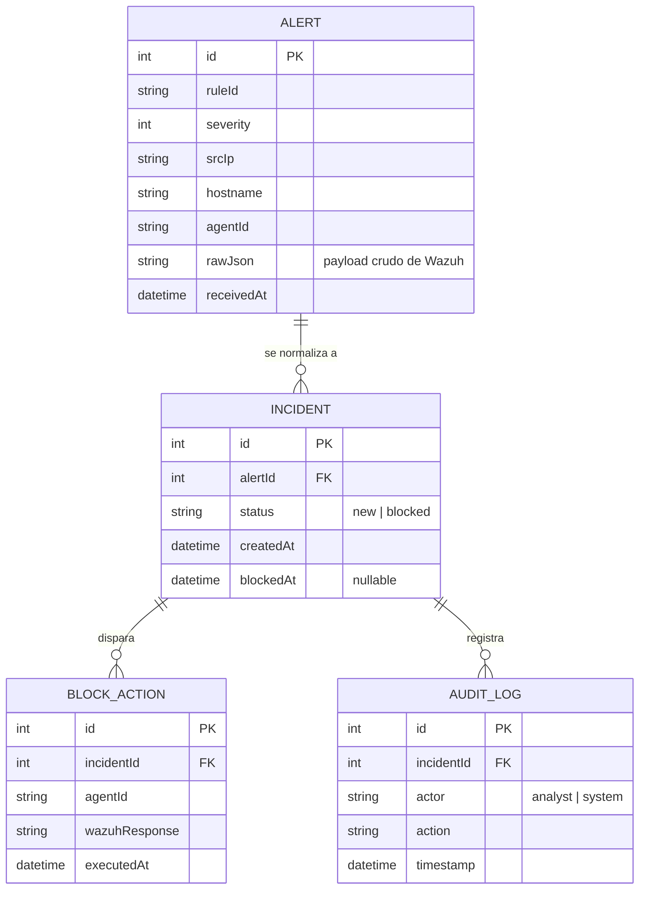
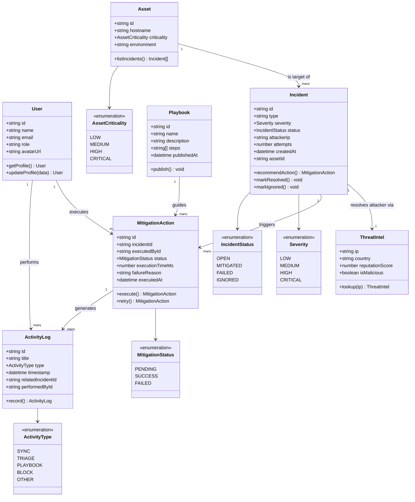

<!-- title: Micro-SOAR — Diagramas de Arquitectura -->

# Micro-SOAR — Diagramas de Arquitectura

Los cuatro diagramas que pediste, en Mermaid, armados a partir del código real del repo (`orchestrator/`, `AppMicroSOAR/`, `terraform/`) y de `PLAN.md`, no de una plantilla genérica. Cada sección tiene el código para copiar y una nota corta de qué decisión de diseño encierra.

| # | Diagrama | Responde a |
|---|---|---|
| 1 | Arquitectura de despliegue | ¿Dónde vive cada componente y cómo se hablan? |
| 2 | Secuencia | ¿Qué pasa, en orden, desde el ataque hasta el bloqueo? |
| 3 | Casos de uso | ¿Qué dispara el analista a mano vs. qué resuelve el sistema solo? |
| 4 | Entidad-Relación | ¿Cómo es la base hoy, y cómo escala si sobra tiempo? |

---

## 1. Arquitectura de despliegue (alto nivel)

**Qué decisión encierra este dibujo:** la flecha punteada del celular al orchestrator es la única forma de llegar a la API — no hay ningún puerto 8000 abierto en el security group (ver `terraform/main.tf`, `aws_security_group.orchestrator`), ni siquiera a tu IP. Ese es el argumento Zero Trust de la tesis: el backend del SOAR nunca está expuesto a `0.0.0.0/0`, solo es alcanzable dentro de la tailnet cifrada. La única flecha "abierta al mundo" es la del atacante contra la víctima, que es justamente la que se quiere cortar.

*Fuente: `terraform/main.tf` (security groups), `orchestrator/integrations/custom-microsoar.py` (webhook), `orchestrator/src/wazuh.js` (llamada a la API de Wazuh).*

---

## 2. Secuencia (el core business)

**Qué decisión encierra este dibujo:** el step-up biométrico (`App→Analyst→App`) pasa *antes* de la llamada de red al orchestrator, no después — es local al dispositivo, no un segundo POST. Y el tiempo que se muestra en "Success" (ver `AppMicroSOAR/app/loading.tsx`) se mide justo entre el POST de bloqueo y la respuesta 200: es el número real que reemplaza a los 8–14 minutos del flujo tradicional.

*Fuente: `orchestrator/src/app.js`, `orchestrator/src/normalize.js`, `orchestrator/src/wazuh.js`, `AppMicroSOAR/app/{index,auth,confirm,loading,success}.tsx`.*

---

## 3. Casos de uso

Mermaid no tiene un tipo de diagrama UML de casos de uso nativo (sin actores "monigote" ni óvalos reales), así que esta versión lo aproxima con un flowchart. Si tu entrega necesita la notación UML formal, más abajo dejo el mismo diagrama en PlantUML, que sí soporta `usecase` y `actor` de verdad.

### Versión Mermaid (aproximada)

**Qué decisión encierra este dibujo:** solo hay **un** caso de uso crítico que el analista dispara a mano — bloquear la IP, resaltado en el diagrama — y va con step-up biométrico porque el PLAN lo marca como irrenunciable. Todo lo que pasa *antes* (detectar, normalizar, persistir) es 100% automático y no depende de que nadie mire el celular. Esa línea (manual vs. automático) es exactamente el corte de alcance del MVP.

### Versión PlantUML (notación UML formal)

*Fuente: `PLAN.md` secciones 1 y 4 (alcance del MVP), `AppMicroSOAR/app/auth.tsx` (step-up real con `expo-local-authentication`).*

---

## 4. Modelo Entidad-Relación (DER)

Ojo con este: hoy la base **no** tiene tablas separadas de alertas, reglas de bloqueo y auditoría — todo vive en una sola tabla `incidents` (ver `orchestrator/prisma/schema.prisma`). Te dejo las dos versiones para que no la tesis no diga algo que el código no hace:

### DER actual (lo que está implementado)

Una sola entidad: el orchestrator normaliza la alerta cruda de Wazuh directamente a `Incident` y la persiste ahí (`normalizeWazuhAlert()`), sin guardar la alerta original ni un log de auditoría separado.

### DER extendido (roadmap — PLAN.md sección 9, no implementado)

**Qué decisión encierra este dibujo:** separar `ALERT` de `INCIDENT` permite guardar el payload crudo de Wazuh sin perderlo (hoy se descarta después de normalizar), y `AUDIT_LOG` es justo el ítem que el PLAN pone en "si sobra tiempo" (sección 4) — con este modelo ya está pensado para no rediseñar nada si se llega a implementar antes del 18/08.

*Fuente: `orchestrator/prisma/schema.prisma`, `PLAN.md` sección 9 ("Diseño para escalar").*

---

## 5. Modelo de dominio objetivo (class diagram — trabajo futuro, no implementado)

Este es un modelo de dominio más completo que el DER roadmap de la sección 4: agrega `User`, `Asset` y `Playbook` como entidades propias, separa el enriquecimiento en `ThreatIntel` y modela la acción de bloqueo como `MitigationAction` (con reintentos y motivo de fallo) en vez de un `BLOCK_ACTION` plano. Es el "hacia dónde escala esto" para la sección de trabajo futuro de la tesis — **nada de esto está implementado** ni entra en el MVP del 18/08 (ver `PLAN.md` sección 4, "Fuera del MVP").

**Cómo se relaciona con lo que ya existe:**
- `Incident` (con `Severity`/`IncidentStatus`) es la evolución natural de la tabla `INCIDENT` de hoy — hoy `severity` es un `int` crudo de Wazuh y `status` es un string libre (`"new" | "blocked"`), acá quedarían como enums propios.
- `MitigationAction` reemplaza al `BLOCK_ACTION` del DER roadmap, agregando reintentos (`retry()`) y motivo de fallo — cosas que hoy `orchestrator/src/wazuh.js` no modela (si el bloqueo falla, solo se propaga un error 502, no se persiste el intento).
- `ThreatIntel` es la contraparte de "Enriquecimiento VT/AbuseIPDB cacheado" (`PLAN.md` sección 4, "si sobra tiempo").
- `ActivityLog` es el mismo concepto que `AUDIT_LOG` en el DER roadmap.
- `User`, `Asset` y `Playbook` son los tres conceptos genuinamente nuevos frente a todo lo documentado hasta ahora: no tienen equivalente ni en el código ni en el roadmap de `PLAN.md`. Son los que más rediseño de API y de app implicarían si algún día se implementan (login pasaría de env vars a tabla `User`, el bloqueo pasaría de "un endpoint" a "ejecutar un `Playbook`").

*Fuente: diagrama provisto por el usuario, contrastado contra `orchestrator/prisma/schema.prisma`, `orchestrator/src/{app,wazuh,auth}.js`, `PLAN.md` secciones 4 y 9.*
