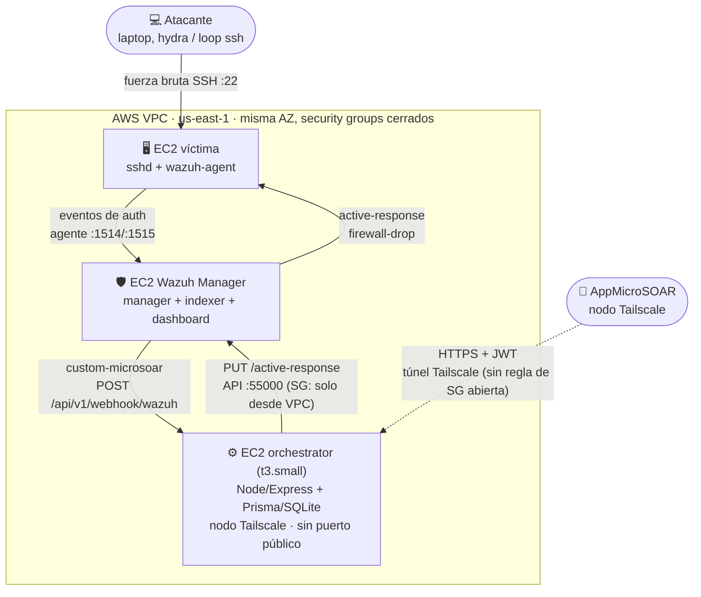
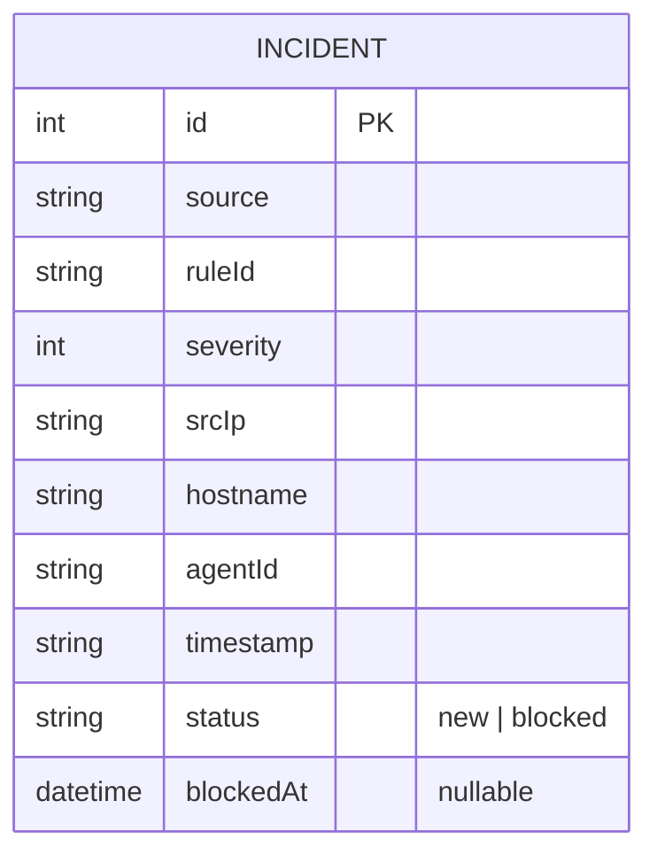

<!-- title: Micro-SOAR — Capítulos 6 a 10 (borrador) -->

# Micro-SOAR — Capítulos 6 a 10 (borrador para tesis)

> Documento de trabajo. Arma los capítulos pedidos (Análisis de Requerimientos,
> Diseño de la Solución, Modelo de Datos, Desarrollo del MVP/Demo) a partir de
> lo que ya existe en el repo (`DIAGRAMAS.md`, `PLAN.md`, `progress.md`,
> `BITACORA_DESARROLLO.md`, código real) y del documento de propuesta
> (`E25-PFI-Diaz-Perversi-MICRO-SOAR.pdf`). Cada sección marca explícitamente
> qué está confirmado contra código/infra real y qué es todavía objetivo o
> está pendiente de dato.

---

## ⚠️ Discrepancia a resolver antes de cerrar el documento

La propuesta (sección 2.4.3, "Stack Tecnológico") especifica **Android nativo
en Kotlin + Jetpack Compose**. El código real en `AppMicroSOAR/` es
**Expo / React Native** (ver `AppMicroSOAR/AGENTS.md`, que instruye trabajar
contra la documentación de Expo v54, y el historial de commits: "react native
front"). Es la misma tensión propuesta-vs-implementación que ya se resolvió
una vez para el backend (`BITACORA_DESARROLLO.md`, Entrada 2: Python→Node
porque la propuesta ya evaluada especificaba Node), pero acá quedó sin
resolver en sentido contrario. Antes de escribir la sección de stack
tecnológico en el capítulo 7 hace falta decidir: ¿se justifica el cambio
Kotlin→React Native igual que se justificó Python→Node (como una entrada más
en `BITACORA_DESARROLLO.md`), o se vuelve a nativo? Dejé el capítulo 7 con
esto marcado en vez de elegir por ustedes.

De manera similar, la propuesta menciona PostgreSQL + Redis, "Four-Eyes
Principle" y "aislamiento de hosts" como capacidades de la capa de interfaz
(2.4.2.3). Hoy: la base es SQLite (Postgres es roadmap, ver
`BITACORA_DESARROLLO.md`), Redis no está integrado (`PLAN.md`, "Fuera del
MVP"), y Four-Eyes tampoco (mismo lugar). Esto ya está bien documentado y
justificado en el repo — no es una discrepancia nueva, solo la dejo listada
acá para que el capítulo 7 la cite de forma consistente.

**Tercera discrepancia, la más grande en superficie:** la propuesta (sección
2.3, "Alcance") compromete el prototipo a evaluarse con **3 PoC**: ataque de
red (fuerza bruta), infección de equipo, y correos maliciosos reportados.
`PLAN.md` (Opción A recortada) reduce el guion de la demo a **1 solo flujo**
(fuerza bruta) por deadline y equipo de 2 personas — decisión razonable y ya
documentada, pero que dos de los tres PoC comprometidos formalmente
(CU-02 "aislar endpoint", CU-03 "eliminar correo de phishing") quedan sin
implementar. Además, **CU-03 no tiene ninguna Historia de Usuario que lo
respalde** en el User Research (ver capítulo 6, sección 6.5) — es la brecha
más profunda de las tres. Documenté ambos casos de uso al mismo nivel de
detalle que el implementado (capítulo 6, sección 6.5, y `DIAGRAMAS.md`
sección 4) para que quede visible en la tesis qué parte del alcance formal
se cubre con código y cuál queda como diseño objetivo — la decisión de si
alcanza el tiempo para implementar alguno de los dos antes del 18/08, o si
se documentan como trabajo futuro con justificación explícita, es de
ustedes.

---

## Capítulo 6 — Análisis de Requerimientos

> Nota metodológica: en el PDF de propuesta (`E25-PFI-Diaz-Perversi-MICRO-SOAR.pdf`),
> las secciones equivalentes a este capítulo (ahí numeradas 5 a 10) están sin
> redactar — son placeholders del tipo *"[ Listar como RF-01, RF-02, etc.
> Ejemplos:... Derivarlos del flujo del hilo dorado. ]"*, notas que se
> dejaron a modo de guía para completar después. Este capítulo las completa
> por primera vez, derivando RF/RNF y Casos de Uso de las 19 Historias de
> Usuario (propuesta, sección 3.3.3.4), las 5 entrevistas (sección 3.3.3.2) y
> la brecha identificada en el Estado del Arte (sección 4.2) — no de cero.

### 6.1 Síntesis del User Research

El equipo descartó una encuesta cuantitativa (tamaño de muestra inalcanzable
para un perfil tan específico — analistas de SOC con experiencia en guardias
on-call — y bajo valor informativo para decisiones de diseño) y optó por 5
entrevistas semiestructuradas a profesionales de ciberseguridad (Operaciones,
SOC, Riesgo/Compliance, Especialista SOC, Líder de Operaciones), más la
construcción de 3 User Personas (Analista L1 "Olivia", Líder SOC "Marcos",
CISO "Fernando").

Tres hallazgos de las entrevistas son los que más peso tienen sobre las
decisiones de diseño ya tomadas en el MVP:

1. **El MTTR real varía enormemente entre organizaciones (3 min a 60 min) y
   casi nadie lo mide formalmente.** Esto es relevante para el capítulo 9-10:
   ninguno de los 5 entrevistados pudo dar un número medido con precisión —
   refuerza que el "8-14 minutos" citado de la literatura en la propuesta es
   un punto de referencia externo, no un baseline propio, y que medir el
   propio MTTR de la demo (aunque sea una sola corrida) ya es un aporte.
2. **Dual Review / Four-Eyes fue pedido espontáneamente por 4 de los 5
   entrevistados** para acciones de alto impacto (Entrevista 1: "tendrían que
   intervenir Infraestructura, Seguridad y el negocio"; Entrevista 3: "el
   famoso principio de cuatro ojos"; Entrevista 4: "idealmente para acciones
   de alto impacto debería existir Dual Review... pero hay que tener una
   excepción para incidentes realmente críticos"; Entrevista 5: "debería
   existir una doble validación... si el aprobador no está disponible... el
   sistema debería tener un mecanismo de escalamiento automático"). Esto le
   da respaldo empírico directo a que Four-Eyes esté en `PLAN.md` como
   "Fuera del MVP" por restricción de tiempo (deadline, equipo de 2 personas)
   y **no** porque no importe — es, según la propia investigación de
   usuarios, uno de los controles más pedidos. Vale la pena decirlo así de
   explícito en la tesis en vez de dejarlo como una omisión silenciosa.
3. **El riesgo percibido no es "que la biometría falle", es "que el
   dispositivo quede desatendido o comprometido".** (Entrevista 1: "que el
   celular quede desatendido"; Entrevista 2: "que alguien pueda acceder al
   dispositivo si queda desbloqueado"; Entrevista 5, la cita más fuerte:
   *"Que el teléfono se convierta en la 'llave maestra del reino'"*). Esto
   justifica por qué el step-up biométrico se diseñó como una verificación
   *por acción* (cada bloqueo pide biometría de nuevo) y no como una sesión
   persistente tras el login — que es exactamente la brecha "Confianza de
   Sesión vs. Confianza por Acción" que describe el Estado del Arte (4.2.2.2).

También hay una tensión productiva entre entrevistados sobre qué tan
restrictivo debe ser el acceso desde el celular: la Entrevista 1 (acceso
"bastante irrestricto, siempre que sea a través de VPN") contrasta con la
Entrevista 3 ("ni siquiera está permitido instalar Zscaler... en el
celular"). El MVP se ubica deliberadamente en un punto intermedio: una sola
acción crítica (bloquear IP), con step-up, sobre un canal Zero Trust — ni tan
laxo como la Entrevista 1 ni tan restrictivo como la Entrevista 3.

### 6.2 Historias de Usuario → trazabilidad a RF y estado real

> Nota de consistencia: en una versión anterior de este documento había dos
> numeraciones RF-01...RF-13 distintas y contradictorias (una en esta tabla,
> otra en la lista de prosa de 6.3) que se pisaban entre sí. Se unificaron acá
> en una sola numeración canónica RF-01 a RF-20, usada igual en la tabla y en
> las descripciones de 6.3.

Las 19 HU de la propuesta (sección 3.3.3.4), contrastadas contra lo que el
MVP implementa hoy (no contra lo que aspira a implementar):

| HU | Resumen | RF asociado | Estado |
|---|---|---|---|
| HU-01 | Recibir alertas críticas en el celular | RF-03 | **Implementado** (polling vía `GET /incidents`; push/FCM está fuera de alcance, ver `PLAN.md` "colchón de recorte") |
| HU-02 | Ver resumen ejecutivo del incidente | RF-07 | Parcial — el detalle muestra los campos crudos normalizados (`ruleId`, `severity`, `srcIp`...), no un resumen sintetizado |
| HU-03 | Ver activos afectados | RF-08 | Parcial — solo `hostname`/`agentId`, no un listado de activos relacionados |
| HU-04 | Aislar un endpoint | RF-10 | Fuera del MVP (`PLAN.md`, "aislamiento de host") — CU-02 |
| HU-05 | Líder SOC aprueba acciones críticas | RF-11 | Fuera del MVP (Four-Eyes, ver 6.1) |
| HU-06 | Segundo aprobador recibe solicitudes | RF-11 | Fuera del MVP (mismo RF que HU-05) |
| HU-07 | Auditor consulta todos los registros | RF-12 | Roadmap ("si sobra tiempo" — audit log, `PLAN.md` sección 4) |
| HU-08 | Administrador define permisos | RF-13 | Fuera del MVP — hoy hay un solo rol fijo (`soc-analyst`) vía env vars |
| HU-09 | Ingresar con biometría | RF-04 | **Implementado** (step-up local antes del POST de bloqueo) |
| HU-10 | Consultar MITRE ATT&CK de la técnica | RF-14 | Fuera del MVP — Wazuh mapea a MITRE internamente, pero no se expone en la app |
| HU-11 | Recibir recomendaciones automáticas | RF-15 | Roadmap — el mockup lo muestra ("Automatic Recommendation: Block IP"), no hay motor de recomendación real |
| HU-12 | CISO mide el MTTR | RF-16 | Pendiente de instrumentar (ver capítulo 9-10) |
| HU-13 | Gerente consulta métricas de ROI | RF-17 | Fuera del MVP |
| HU-14 | Ver toda la evidencia de la alerta | RF-09 | Parcial — se persiste la alerta normalizada, no el payload crudo de Wazuh completo |
| HU-15 | Bloquear una IP | RF-05 | **Implementado** — es el hilo dorado del MVP, CU-01 |
| HU-16 | Bloquear un hash | RF-18 | Fuera del MVP — solo hay acción de bloqueo por IP (`firewall-drop`) |
| HU-17 | Revocar sesiones | RF-18 | Fuera del MVP (mismo RF que HU-16) |
| HU-18 | Consultar historial de acciones | RF-12 | Roadmap (mismo RF que HU-07, audit log) |
| HU-19 | Recibir alertas enriquecidas | RF-19 | Roadmap ("si sobra tiempo" — enriquecimiento VT/AbuseIPDB) |
| *(sin HU)* | Eliminar correo de phishing | RF-20 | Fuera del MVP — CU-03, **sin Historia de Usuario que lo respalde** (ver 6.5) |

**Lectura honesta de esta tabla:** de 19 HU relevadas en el User Research,
el MVP implementa de forma completa 3 (HU-01, HU-09, HU-15 — exactamente el
hilo dorado de `PLAN.md`), 3 de forma parcial, y deja 13 como roadmap o
explícitamente fuera de alcance. Esto no es un déficit a esconder: es el
resultado directo y trazable del recorte de alcance documentado en `PLAN.md`
sección 4, y ahora queda justificado contra investigación de usuarios real
en vez de solo contra una decisión de equipo.

### 6.3 Requerimientos Funcionales (RF)

**RF del MVP (implementados, verificables contra código):**
- **RF-01.** El sistema debe detectar intentos de fuerza bruta SSH mediante
  reglas nativas de Wazuh (regla 5712, level ≥ 10), sin desarrollo de reglas
  propio.
- **RF-02.** El orquestador debe normalizar la alerta cruda de Wazuh a un
  modelo `Incident` propio, rechazando (`422`) alertas con campos
  incompletos.
- **RF-03.** El sistema debe listar los incidentes persistidos
  (`GET /api/v1/incidents`) y mostrar el detalle de uno (`GET /:id`),
  requiriendo autenticación JWT (HU-01).
- **RF-04.** La app debe requerir verificación biométrica (Face ID/huella) o
  PIN, local al dispositivo, antes de cualquier acción de contención (HU-09).
- **RF-05.** El analista debe poder ejecutar el bloqueo de la IP atacante
  desde la app (`POST /:id/actions/block-ip`) contra la API real de Wazuh
  (`PUT /active-response`, `firewall-drop`), no simulado — **CU-01** (HU-15).
- **RF-06.** El sistema debe registrar el resultado del bloqueo (`status`,
  `blockedAt`) sobre el incidente.

**RF parcialmente cubiertos:**
- **RF-07.** Mostrar un resumen ejecutivo del incidente (HU-02) — hoy solo
  se muestran los campos crudos normalizados.
- **RF-08.** Mostrar los activos afectados por el incidente (HU-03) — hoy
  solo `hostname`/`agentId`, sin relación a un catálogo de activos.
- **RF-09.** Mostrar toda la evidencia de la alerta (HU-14) — se persiste la
  alerta normalizada, no el payload crudo completo de Wazuh.

**RF de trabajo futuro (trazados a HU, no implementados):**
- **RF-10.** Detectar infección de equipo (Wazuh FIM/rootcheck o regla de
  malware, level alto) y permitir al analista aislar el endpoint afectado
  desde la app, con el mismo step-up biométrico que RF-04 — **CU-02**, uno
  de los 3 PoC comprometidos en la propuesta (sección 2.3), hoy "Fuera del
  MVP" en `PLAN.md` (HU-04).
- **RF-11.** Requerir aprobación de un segundo rol (Four-Eyes) para acciones
  de alto impacto (HU-05, HU-06) — hoy **no existe ningún paso de segundo
  aprobador** en el código ni en los diagramas de secuencia/casos de uso: el
  flujo real es step-up biométrico → POST directo → ejecución. Es la brecha
  más señalada por el propio User Research (6.1).

  **Decisión tomada (2026-08-16):** queda como trabajo futuro, no se
  implementa antes del 18/08 — priorizando no arriesgar el hilo dorado que sí
  funciona a dos días del cierre. Respuesta preparada si el jurado pregunta
  "¿dónde aprueba el segundo rol?": *"Lo relevamos como uno de los controles
  más pedidos en las 5 entrevistas (4 de 5 lo mencionan espontáneamente,
  sección 6.1) y lo diseñamos — está en las HU-05/HU-06 y en RF-11 — pero
  decidimos no implementarlo en el MVP para no comprometer el único flujo que
  sí corre de punta a punta contra infraestructura real. Es la primera línea
  del roadmap post-defensa."* Es una respuesta más sólida que no tener nada
  preparado, y más honesta que simular que está resuelto.
- **RF-12.** Registrar y consultar un audit log por acción crítica
  (HU-07, HU-18).
- **RF-13.** Gestionar permisos por rol (RBAC real, no un rol fijo) (HU-08).
- **RF-14.** Exponer la técnica MITRE ATT&CK asociada al incidente (HU-10).
- **RF-15.** Generar recomendaciones automáticas de mitigación (HU-11) — el
  mockup lo muestra ("Automatic Recommendation: Block IP"), no hay motor de
  recomendación real.
- **RF-16.** Medir y exponer el MTTR/MTTD (HU-12) — pendiente de instrumentar,
  ver capítulo 9-10.
- **RF-17.** Exponer métricas de ROI a roles gerenciales (HU-13).
- **RF-18.** Bloquear un hash / revocar una sesión como acciones de
  contención adicionales (HU-16, HU-17).
- **RF-19.** Enriquecer automáticamente la IP atacante con VirusTotal/AbuseIPDB
  (HU-19).
- **RF-20.** Poner en cuarentena / eliminar un correo reportado como
  phishing — **CU-03**, el tercer PoC de la propuesta (sección 2.3), también
  "Fuera del MVP" en `PLAN.md` ("phishing"). **Sin HU asociada:** ninguna de
  las 19 Historias de Usuario relevadas cubre este escenario — es una brecha
  del User Research frente al alcance comprometido, no solo un recorte por
  tiempo. Vale la pena sumar una HU-20 antes de cerrar el documento, o dejar
  esta brecha reconocida explícitamente.

### 6.4 Requerimientos No Funcionales (RNF)

Derivados directamente de la brecha del Estado del Arte (sección 4.2) y de
las preocupaciones repetidas en las entrevistas — no genéricos:

- **RNF-01 — Confianza por acción, no por sesión (Zero Trust, NIST SP
  800-207).** Cada acción crítica revalida al usuario (step-up biométrico),
  no solo la sesión JWT. Responde directamente a la brecha "Confianza de
  Sesión vs. Confianza por Acción" (4.2.2.2) que el Estado del Arte identifica
  como no resuelta por ninguna plataforma SOAR analizada, enterprise u
  open-source.
- **RNF-02 — Superficie de red oculta ("Dark Cloud").** El backend no debe
  ser alcanzable desde internet público bajo ninguna circunstancia; solo
  desde la overlay network (Tailscale/WireGuard). Responde a la brecha
  "Exposición Perimetral: VPN Tradicional vs. Zero Trust" (4.2.2.3).
- **RNF-03 — Latencia de contención en el orden de segundos, no minutos.**
  Meta cuantitativa: bajar de la ventana de 8-14 minutos (VPN + consola,
  según la literatura citada) a segundos desde el dispositivo móvil. Es la
  métrica central del capítulo 9-10.
- **RNF-04 — Ejecución móvil con capacidad operativa completa, no solo
  visualización.** A diferencia de Falcon for Mobile (CrowdStrike) o las
  apps de Azure/M365 para Sentinel, que solo muestran telemetría, la acción
  de bloqueo debe poder *ejecutarse* desde el celular. Es el hallazgo
  central de la Tabla 3.1 del Estado del Arte: ninguna plataforma
  enterprise analizada ofrece esto hoy.
- **RNF-05 — Simplicidad operativa por sobre cobertura de funciones.**
  Citado casi textual de dos entrevistas independientes (Entrevista 2: "Es
  preferible que haga pocas cosas y las haga bien"; Entrevista 5: "que no
  intenten construir un SOAR completo en miniatura... Eviten el
  over-engineering"). Es el mismo principio que ya rige el desarrollo
  (`CLAUDE.md`, "Simplicity First") — acá queda además respaldado por
  investigación de usuarios, no solo por preferencia del equipo.
- **RNF-06 — Trazabilidad de las acciones críticas.** Aun sin Four-Eyes
  implementado, cada acción de bloqueo debe quedar registrada de forma
  verificable (hoy: `status`/`blockedAt` sobre el `Incident`; roadmap:
  audit log completo).
- **RNF-07 — Limitación conocida: el step-up biométrico no tiene prueba
  criptográfica verificable por el backend.** La verificación biométrica
  (`expo-local-authentication`) ocurre enteramente en el dispositivo; la app
  luego hace un `POST /:id/actions/block-ip` que el backend solo autoriza
  contra el JWT de sesión (`orchestrator/src/auth.js`, `requireAuth`) — no
  recibe ni valida ninguna prueba de que el gate biométrico efectivamente
  ocurrió. En términos de la propia brecha "Confianza de Sesión vs.
  Confianza por Acción" que cita el Estado del Arte (4.2.2.2): el *diseño*
  de Micro-SOAR resuelve esa brecha a nivel de UX (pide biometría antes de
  cada acción), pero no a nivel criptográfico — un dispositivo rooteado o
  comprometido podría, en teoría, saltear el gate local de la app e invocar
  el endpoint directamente con un JWT válido. Esto conecta con el OWASP
  Mobile Top 10 que la propuesta ya cita (sección 3.3.2, *attestation*/
  detección de root) y con el principio NIST de validación continua de
  integridad del dispositivo (2.6.1, "validación de seguridad en tiempo
  real"). **Recomendación:** reconocerlo como limitación conocida del MVP en
  el capítulo de resultados, no dejarlo implícito — es exactamente el tipo
  de honestidad técnica que ya se aplicó en el resto de este documento (ver
  tabla 7.6). Resolverlo de verdad implicaría que la app firme un desafío
  con una clave protegida por el enclave seguro del dispositivo
  (Android Keystore) tras la biometría, y que el backend verifique esa firma
  — no es un cambio menor, queda como trabajo futuro, no como algo a
  improvisar a dos días del 18/08.

### 6.5 Casos de Uso

Los 3 casos de uso críticos, uno por cada PoC comprometido en la propuesta
(sección 2.3, "Alcance"). Comparten el mismo esqueleto (step-up biométrico →
acción de mitigación → auditoría); **solo CU-01 está implementado**, CU-02 y
CU-03 se documentan al mismo nivel de detalle porque son parte del alcance
formal, aunque hoy estén "Fuera del MVP" en `PLAN.md`. El resto de los casos
de uso de apoyo (login, listar, ver detalle) están en `DIAGRAMAS.md` sección 4.

**CU-01 — Bloquear IP durante un ataque de fuerza bruta [Implementado]**
- **Actor:** Analista SOC (guardia remota/on-call).
- **Precondición:** existe un `Incident` con `status = "new"` originado por
  la regla nativa de Wazuh 5712 (brute force, level ≥ 10); el analista está
  autenticado (JWT vigente) y tiene conectividad a la overlay network.
- **Flujo principal:**
  1. El analista abre el detalle del incidente.
  2. Toca "Bloquear IP".
  3. La app solicita verificación biométrica (Face ID/huella) o PIN, local
     al dispositivo.
  4. Verificación exitosa → la app envía `POST /:id/actions/block-ip` con el
     Bearer token.
  5. El orquestador autentica contra la API de Wazuh y ejecuta
     `firewall-drop` sobre el agente correspondiente.
  6. Wazuh confirma (`error: 0`, sin `failed_items`); el orquestador
     actualiza `status = "blocked"`.
  7. La app muestra la pantalla de éxito con el tiempo transcurrido.
- **Flujos alternativos:**
  - 3a. Verificación biométrica falla o se cancela → se vuelve al detalle,
    sin llamar al backend (ningún request se envía).
  - 5a. Wazuh rechaza la autenticación o el comando → el orquestador
    responde `502`; la app muestra el error sin marcar el incidente como
    bloqueado.
  - 4a. El JWT expiró → `401`; la app fuerza un nuevo login antes de
    reintentar.
- **Postcondición (éxito):** `Incident.status = "blocked"`,
  `Incident.blockedAt` seteado, conexión del atacante cortada
  (verificable con `iptables -L -n` en la víctima).

**CU-02 — Aislar endpoint ante una infección de equipo [No implementado — Fuera del MVP]**
- **Actor:** Analista SOC.
- **Precondición (objetivo de diseño):** existe un `Incident` originado por
  una regla de Wazuh de malware/FIM/rootcheck sobre el equipo víctima, con
  `status = "new"`.
- **Flujo principal (objetivo, sin código detrás todavía):**
  1. El analista abre el detalle del incidente y ve el equipo afectado.
  2. Toca "Aislar endpoint".
  3. Step-up biométrico (mismo mecanismo que CU-01).
  4. La app invoca una acción de aislamiento (candidato: `active-response`
     con un script equivalente a `host-deny`/cuarentena de red en vez de
     `firewall-drop`, a definir en el capítulo 7 si se decide implementar).
  5. Wazuh confirma el aislamiento; se actualiza el estado del incidente.
- **Nota de diseño:** requiere un `MitigationAction` con un `type` distinto
  al de bloqueo de IP (ver capítulo 6, "Modelo de dominio objetivo") — hoy
  el modelo `Incident` no distingue tipos de acción porque solo existe una.
- **Por qué no está en el MVP:** `PLAN.md` sección 4 lo excluye explícitamente
  ("aislamiento de host") por restricción de tiempo/equipo, no porque HU-04
  no lo pida.

**CU-03 — Poner en cuarentena un correo reportado como phishing [No implementado — Fuera del MVP, sin HU asociada]**
- **Actor:** Analista SOC; **Usuario final** como actor secundario que
  origina el caso (reporta el correo sospechoso — mecanismo de reporte a
  definir, ej. botón "reportar" en el cliente de correo o un buzón
  dedicado).
- **Precondición (objetivo de diseño):** existe un `Incident` originado por
  el reporte de un usuario, no por Wazuh — esta es la única de las tres
  fuentes de detección que no pasa por el XDR.
- **Flujo principal (objetivo, sin código detrás todavía):**
  1. El usuario final reporta un correo sospechoso.
  2. El sistema crea un `Incident` de tipo "phishing" (triage manual o
     automático, a definir).
  3. El analista revisa el correo reportado desde la app.
  4. Toca "Eliminar / poner en cuarentena".
  5. Step-up biométrico.
  6. El sistema ejecuta la acción sobre el correo (requiere integración con
     un gateway de correo — Microsoft Graph API, Google Workspace API, u
     otro — no contemplada todavía en la arquitectura de `terraform/` ni en
     `orchestrator/`).
- **Nota importante:** a diferencia de CU-01 y CU-02, este caso de uso
  requiere un componente de infraestructura completamente nuevo (integración
  con el proveedor de correo) que hoy no existe ni en el diseño ni en el
  código. Es el PoC con mayor brecha entre lo comprometido en la propuesta y
  lo diseñado hasta ahora.

*(Diagrama de casos de uso completo — Mermaid y PlantUML, con los 3 CU y sus
actores/dependencias — en `DIAGRAMAS.md`, sección 4.)*

---

### Nota menor: nombre de marca en el mockup

El mockup del capítulo 5 de la propuesta usa la marca **"Fortia"** (logo y
header en todas las pantallas), mientras que el resto del proyecto (código,
`PLAN.md`, `README.md`) usa "Micro-SOAR" / "AppMicroSOAR". No es un problema
técnico, pero conviene unificar el nombre antes de la entrega final —
decisión de branding, no de arquitectura, así que la dejo solo anotada.

---

## Capítulo 7 — Diseño de la Solución

### 7.1 Arquitectura de capas

Micro-SOAR se estructura en tres capas coordinadas (propuesta, sección
2.4.2), confirmadas contra la infraestructura real desplegada en AWS
(`terraform/main.tf`):

1. **Capa de Detección (XDR)** — Wazuh Manager sobre una instancia EC2
   dedicada, monitoreando una instancia víctima separada (no el propio
   manager: Wazuh rechaza *active-response* dirigido al agente `000`, ver
   `BITACORA_DESARROLLO.md`, Entrada 1). Genera alertas estructuradas y las
   reenvía por webhook.
2. **Capa de Orquestación (Micro-SOAR)** — backend Node.js/Express sobre una
   segunda instancia EC2, sin puerto público expuesto. Recibe la alerta,
   la normaliza a un modelo `Incident` propio (`orchestrator/src/normalize.js`)
   y persiste. Expone los endpoints HTTPS de consulta y de acción.
3. **Capa de Interfaz (Aplicación móvil)** — consume la API del orquestador
   exclusivamente a través de la red superpuesta Zero Trust (Tailscale/
   WireGuard), nunca por IP pública. Implementa el step-up biométrico antes
   de cualquier acción de contención.

### 7.2 Arquitectura de despliegue



**Decisión de diseño (Zero Trust, NIST SP 800-207):** el backend nunca está
expuesto a `0.0.0.0/0` — la única forma de alcanzarlo es dentro de la tailnet
cifrada, confirmado en `terraform/main.tf` (`aws_security_group.orchestrator`
no tiene reglas de ingreso público). Esto materializa el principio de
"verificación explícita" y "Dark Cloud" descripto en la propuesta (sección
3.2.2): los servicios del orquestador no son descubribles ni escaneables
desde internet.

*(Diagrama completo, versión con enriquecimiento vía VT/AbuseIPDB: `DIAGRAMAS.md`, sección 1.)*

### 7.3 Flujo end-to-end (secuencia)

El "hilo dorado" (`PLAN.md`, sección 2) recorre: detección → normalización →
persistencia → notificación en la app → step-up biométrico local → acción
de contención → confirmación visual. Ver el diagrama de secuencia completo
en `DIAGRAMAS.md`, sección 2 — incluye los tres bloques opcionales
(enriquecimiento de IP, Four-Eyes y audit log) marcados explícitamente como
"si sobra tiempo" para no sobrerrepresentar el alcance mínimo garantizado.

**Punto de diseño relevante para la defensa:** el step-up biométrico ocurre
*localmente en el dispositivo*, antes de la llamada de red — no es un
segundo POST al backend. Esto es consistente con el modelo de autenticación
adaptativa de la propuesta (sección 3.2.3): el dispositivo aporta el factor
de posesión, la biometría el factor de inherencia, y ambos se resuelven
client-side antes de que el token JWT autorice la acción crítica en el
servidor.

### 7.4 Diagrama de flujo (decisiones y ramas de error)

A diferencia de la secuencia (que muestra mensajes entre componentes), el
diagrama de flujo en `DIAGRAMAS.md`, sección 3, muestra el proceso como lo
vive el analista, con cada rama de error trazada a un código HTTP real que
devuelve `orchestrator/src/app.js`:

| Código | Origen | Condición real en el código |
|---|---|---|
| 422 | `POST /webhook/wazuh` | `normalizeWazuhAlert()` no encuentra un campo requerido (`ruleId`, `severity`, `srcIp`, `hostname`, `agentId`, `timestamp`) |
| 401 | `POST /auth/login` | credenciales no coinciden con `AUTH_USER`/`AUTH_PASSWORD` |
| 401 | cualquier endpoint con `requireAuth` | falta el header `Bearer`, o el JWT es inválido/expiró |
| 404 | `GET/POST /incidents/:id...` | no existe un incidente con ese `id` |
| 502 | `POST /incidents/:id/actions/block-ip` | la API de Wazuh rechaza la autenticación o el comando (incluye el caso HTTP 200 con `error != 0`, ver `orchestrator/src/wazuh.js`) |

Esta tabla es un buen candidato para ir directo en el capítulo — son códigos
verificables, no hipotéticos.

### 7.5 Diagrama de flujo base (objetivo, común a los 3 CU)

A diferencia de los diagramas de las secciones 7.3/7.4 (que documentan el
detalle *implementado* de CU-01 específicamente), esta es la versión
abstracta del flujo, generalizada a los 3 casos de uso tal como quedaron
comprometidos en la propuesta (sección 2.3) — mismo nivel "producto final"
que el modelo de dominio objetivo de `DIAGRAMAS.md` sección 6. Se compone de
10 etapas secuenciales, comunes a CU-01/02/03 salvo por la etapa 7
(presencia/omisión de aprobación, según si el CU requiere Four-Eyes) y la
etapa 8 (qué comando se ejecuta). Cada etapa está anotada con su estado real,
para que este diagrama no se lea como una lista de "lo que ya anda":

| # | Etapa | Estado |
|---|---|---|
| 1 | **Detección:** Wazuh clasifica el evento por severidad (motor de reglas, mapeo MITRE ATT&CK). | Implementado para fuerza bruta (regla 5712, CU-01). Las reglas para infección de equipo (CU-02) no están configuradas. |
| 2 | **Reenvío:** la alerta crítica se envía al orquestador vía webhook HTTPS. | Implementado (`POST /webhook/wazuh`). |
| 3 | **Enriquecimiento:** el orquestador consulta VirusTotal/AbuseIPDB de forma asíncrona. | No implementado — candidato "si sobra tiempo" (RF-19). |
| 4 | **Notificación:** push a la app del analista vía la red Zero Trust. | Parcial — la app hace polling (`GET /incidents`), no hay push/FCM (`PLAN.md`, colchón de recorte). |
| 5 | **Triaje:** el analista abre la app y revisa el resumen ejecutivo enriquecido. | Parcial (RF-07) — se muestran los campos crudos normalizados, no un resumen sintetizado. |
| 6 | **Step-Up:** la app pide biometría antes de habilitar la ejecución. | Implementado (RF-04). |
| 7 | **Aprobación condicional:** si el CU la requiere (CU-01/CU-02, Four-Eyes, RF-11) se dispara la solicitud al segundo aprobador; si no (CU-03), se omite. | No implementado. |
| 8 | **Ejecución:** el orquestador traduce la decisión en un comando de mitigación contra la infraestructura correspondiente. | Implementado solo para `block_ip` (RF-05). `isolate_host` (RF-10) y `quarantine_email` (RF-20) son diseño, sin código. |
| 9 | **Registro:** la acción queda persistida en el audit log. | No implementado (RF-12) — hoy solo se persiste `status`/`blockedAt` sobre el `Incident`. |
| 10 | **Confirmación:** el resultado se refleja en la app del analista. | Implementado. |

De 10 etapas, 4 están implementadas de punta a punta (1, 2, 6, 10 — más la
8 acotada a `block_ip`), lo cual traza directo con el mismo mensaje del
capítulo 6: el hilo dorado de CU-01 es real, el resto es diseño validado.

### 7.6 Diagrama de secuencia — acción de contención (Four-Eyes)

Este diagrama ya está armado como diagrama de secuencia completo en
`DIAGRAMAS.md`, sección 2 — incluye el intercambio de mensajes entre
dispositivo, orquestador, Wazuh y el segundo aprobador, con el bloque `opt`
de Four-Eyes agregado el 2026-08-16. No se repite acá como una segunda
versión independiente para evitar que las dos terminen desalineadas (un
borrador anterior de esta sección usaba nombres de endpoint genéricos —
`/alertas/{id}`, `/acciones/bloquear-ip`, `/aprobaciones` — que no coincidían
ni con el contrato real implementado ni con el contrato objetivo de la
sección 8.3; se descartó esa versión en vez de mantener dos fuentes de
verdad). La referencia canónica para este diagrama es `DIAGRAMAS.md` sección 2.

### 7.7 Casos de uso

Ver `DIAGRAMAS.md`, sección 4 (versión Mermaid aproximada y versión PlantUML
con notación UML formal). El corte de diseño relevante: solo **un** caso de
uso lo dispara el analista a mano (bloquear IP, con step-up), todo lo
anterior (detectar, normalizar, persistir) es automático — es exactamente el
"paradigma de respuesta activa" que describe la propuesta (sección 3.1).

### 7.8 Principios Zero Trust aplicados

De la propuesta (sección 2.6.1), contrastado contra qué está confirmado hoy:

| Principio NIST | Mecanismo propuesto | Estado real |
|---|---|---|
| Verificar identidad explícitamente | JWT con claims enriquecidos + step-up biométrico | JWT confirmado (`orchestrator/src/auth.js`); claims hoy son mínimos (`sub`, `role` fijo `soc-analyst`) — el enriquecimiento de claims es roadmap, no implementado |
| Validación de contexto de acceso | IP geográfica, rechazo de "viajes imposibles" | No implementado; no hay lógica de geo-contexto en el código actual |
| Cifrado de todas las comunicaciones | Overlay network Tailscale | Confirmado en Terraform y en el flujo de despliegue |
| Validación de seguridad en tiempo real | Logs de auditoría por acción crítica | No implementado (`AUDIT_LOG` es roadmap, ver `DIAGRAMAS.md` sección 5) |

Esta tabla importa porque la propuesta lista los 4 principios como ya
"implementados" (2.6.1) — para la tesis final conviene distinguir cuáles
están confirmados contra código y cuáles siguen siendo el objetivo de
diseño, en la misma línea que ya hace `DIAGRAMAS.md` con el DER actual vs.
roadmap.

**Matiz sobre "Verificar identidad explícitamente":** más allá de los claims
mínimos del JWT, hay una limitación más profunda a reconocer — el step-up
biométrico se valida enteramente en el dispositivo y el backend nunca recibe
una prueba de que ocurrió, solo el JWT de sesión. El principio de "confianza
por acción" está resuelto a nivel de experiencia de usuario, no a nivel
criptográfico. Detalle completo en capítulo 6, RNF-07.

### 7.9 Stack tecnológico — pendiente de resolver

**No completo esta subsección** hasta que se resuelva la discrepancia
Kotlin/React Native marcada arriba, porque el stack tecnológico final del
capítulo 7 depende de esa decisión.

---

## Capítulo 8 — Modelo de Datos

### 8.1 Modelo entidad-relación

**DER actual (implementado, confirmado contra `orchestrator/prisma/schema.prisma`):**



Una sola entidad: el orchestrator normaliza la alerta cruda de Wazuh
directamente al modelo `Incident` y la persiste ahí — no se guarda la alerta
original ni existe todavía un log de auditoría separado.

**DER extendido / objetivo** (generalizado a los 3 CU — `ALERT`, `INCIDENT`
con `type`, `MITIGATION_ACTION`, `AUDIT_LOG` — versión consolidada el
2026-08-16): ver `DIAGRAMAS.md`, sección 5. **Modelo de dominio objetivo**
(class diagram completo, trabajo futuro — `User`/`Asset`/`Playbook`, sin
implementar): ver `DIAGRAMAS.md`, sección 6.

### 8.2 Responsabilidad de cada entidad del DER objetivo

Trazado contra la numeración canónica de RF del capítulo 6 (no la de
cualquier otro borrador que ande circulando — hubo un desfasaje de
numeración entre versiones, corregido acá):

| Entidad | Responsabilidad | RF que cubre | Estado |
|---|---|---|---|
| `ALERT` | Preserva el payload crudo recibido (de Wazuh o de un reporte de phishing), sin pérdida de trazabilidad forense. | — | **Sin RF de HU directo.** Es una necesidad de diseño de `PLAN.md` sección 9 ("Diseño para escalar"), no algo que ninguna de las 19 HU pidiera explícitamente. No implementado — hoy `normalizeWazuhAlert()` descarta el payload original tras normalizar. |
| `INCIDENT` | Normaliza la alerta y centraliza el contexto consumido en el triaje (resumen ejecutivo, activos afectados). `type` reemplaza al enum binario del modelo actual, diferenciando los 3 escenarios de PoC. | RF-02 (normalizar), RF-03 (listar/detalle, HU-01), RF-07 (resumen ejecutivo, HU-02), RF-08 (activos afectados, HU-03); `type` sostiene a RF-05/RF-10/RF-20 | Parcial — normalización y listado implementados (RF-02/RF-03); resumen ejecutivo y activos afectados son parciales (RF-07/RF-08); el campo `type` no existe hoy (una sola tabla sin distinción de escenario) |
| `MITIGATION_ACTION` | Generaliza la acción de contención — un mismo modelo cubre bloqueo de IP (CU-01), aislamiento de host (CU-02) y cuarentena de correo (CU-03), diferenciados por `actionType`. `requiresApproval`/`approvedById` modelan el Four-Eyes condicional (obligatorio en CU-01/CU-02, omitido en CU-03). | RF-05 (CU-01), RF-10 (CU-02), RF-20 (CU-03, sin HU asociada), RF-11 (Four-Eyes) | Parcial — solo `actionType=block_ip` (RF-05) tiene código real (`orchestrator/src/wazuh.js`); `isolate_host`, `quarantine_email` y Four-Eyes son diseño, sin implementación |
| `AUDIT_LOG` | Registro inmutable de cada acción ejecutada, con actor, tipo de acción y timestamp. | RF-12 (funcional, HU-07/HU-18), RNF-06 (trazabilidad) | No implementado |

### 8.3 Contrato de API — versión implementada (v1)

Confirmado contra `orchestrator/src/app.js` (no contra el contrato aspiracional
de `PLAN.md` sección 7, que incluye `GET /api/v1/audit`, todavía sin
implementar).

#### `POST /api/v1/auth/login`
Sin autenticación previa.
```
Request:  { "username": string, "password": string }
200:      { "token": "<JWT, expira en 12h>" }
401:      { "detail": "Invalid credentials" }
```

#### `POST /api/v1/webhook/wazuh`
Sin autenticación (llamado por Wazuh vía integración `custom-microsoar`, no
por la app).
```
Request:  payload crudo de alerta de Wazuh (rule.id, rule.level, data.srcip,
           agent.name, agent.id, timestamp)
201:      Incident creado { id, source: "wazuh", ruleId, severity, srcIp,
           hostname, agentId, timestamp, status: "new" }
422:      { "detail": "Campo faltante en la alerta de Wazuh: <campos>" }
```

#### `GET /api/v1/incidents`
Requiere `Authorization: Bearer <jwt>`.
```
200:      [ ...Incident ], orden descendente por id
401:      { "detail": "Missing bearer token" } | { "detail": "Invalid or expired token" }
```

#### `GET /api/v1/incidents/:id`
Requiere Bearer.
```
200:      Incident
404:      { "detail": "Incident not found" }
401:      (igual que arriba)
```

#### `POST /api/v1/incidents/:id/actions/block-ip`
Requiere Bearer. Este es el único endpoint que dispara efectos en
infraestructura real (autentica contra la API de Wazuh y ejecuta
`firewall-drop` vía `PUT /active-response`).
```
200:      { "incidentId", "srcIp", "agentId", "status": "blocked" }
404:      { "detail": "Incident not found" }
502:      { "detail": "<mensaje de error de Wazuh: login rechazado o
           comando rechazado>" }
401:      (igual que arriba)
```

Efecto colateral: en éxito, persiste `status = "blocked"` y `blockedAt = now()`
sobre el `Incident`.

### 8.4 Contrato de API — versión objetivo (los 3 CU)

Extiende 8.3 con los endpoints que sostienen CU-02, CU-03, Four-Eyes y el
audit log. Ninguno de los marcados "No implementado" existe hoy en
`orchestrator/src/app.js` — este contrato es el diseño consolidado contra el
modelo de datos de 8.1/8.2, no una descripción de código real.

| Método | Endpoint | Auth | Descripción | Estado |
|---|---|---|---|---|
| POST | `/api/v1/webhook/wazuh` | Interno (SG restringido a la VPC) | Recibe la alerta cruda de Wazuh, la normaliza a `Incident`. | **Implementado** |
| POST | `/api/v1/auth/login` | — (emite el token) | Autentica al analista y emite un JWT. | **Implementado** |
| GET | `/api/v1/incidents` | Bearer JWT | Lista de incidentes, incluyendo `type` y enriquecimiento cacheado (RF-03, RF-19). | Parcial — lista implementada; `type` y enriquecimiento, no |
| GET | `/api/v1/incidents/:id` | Bearer JWT | Detalle de un incidente (resumen ejecutivo, RF-03/RF-07). | Parcial — detalle implementado; resumen ejecutivo sintetizado, no |
| POST | `/api/v1/incidents/:id/actions/block-ip` | Bearer JWT + Step-Up | Crea una `MitigationAction` (`actionType=block_ip`), ejecuta active-response contra Wazuh (RF-05). | **Implementado** |
| POST | `/api/v1/incidents/:id/actions/isolate-host` | Bearer JWT + Step-Up | Crea una `MitigationAction` (`actionType=isolate_host`) para CU-02 (RF-10). | No implementado |
| POST | `/api/v1/incidents/:id/actions/quarantine-email` | Bearer JWT + Step-Up | Crea una `MitigationAction` (`actionType=quarantine_email`) para CU-03 (RF-20). `requiresApproval=false` por defecto. | No implementado |
| POST | `/api/v1/actions/:id/approve` | Bearer JWT (rol aprobador) | Registra `approvedById` sobre una `MitigationAction` con `requiresApproval=true` (Four-Eyes, CU-01/CU-02, RF-11). | No implementado |
| GET | `/api/v1/audit` | Bearer JWT | Devuelve el `AUDIT_LOG` asociado a un incidente o al historial del analista (RF-12). | No implementado |

### 8.5 Nota de trazabilidad

El contrato de `PLAN.md` sección 7 incluye `GET /api/v1/audit` marcado como
"(opcional)" — no está implementado y por eso no aparece en 8.3 (solo en la
versión objetivo de 8.4). Si se decide implementar el audit log (`PLAN.md`,
"si sobra tiempo"), moverlo de 8.4 a 8.3 una vez exista código que lo
respalde, no antes.

---

## Capítulos 9-10 — Desarrollo del MVP / Demo

Los capítulos 7 y 8 describen el diseño **objetivo** del producto final: los
3 CU, Four-Eyes, el modelo de datos extendido, el contrato de API completo.
Es diseño legítimo — corresponde a lo que la propuesta comprometió en su
sección 2.3 — pero si el documento terminara ahí, cualquier lector asumiría
que todo eso ya funciona. Este capítulo cierra ese círculo: documenta qué
parte de ese diseño está **implementada y verificada** al 18/08 (checkpoint
intermedio del MVP, no la entrega final), apoyándose en la misma tabla de
trazabilidad HU→RF→estado del capítulo 6, sección 6.2 — no la repite, la
resume:

- **3 de 19 HU implementadas completas** (HU-01, HU-09, HU-15 — recibir
  alertas, biometría, bloquear IP: el hilo dorado de CU-01).
- **3 parciales** (HU-02, HU-03, HU-14 — resumen ejecutivo, activos
  afectados, evidencia completa: existe el dato crudo, falta la síntesis).
- **13 son diseño, no código** — Four-Eyes, CU-02, CU-03, audit log,
  enriquecimiento, RBAC, métricas, MITRE ATT&CK, recomendaciones.

**Estado: bloqueado en la parte cuantitativa.**

Lo que sí está confirmado y se puede escribir ya como "implementación":

- **Fase 0 (eslabón crítico):** bloqueo de IP real vía API de Wazuh,
  confirmado con `iptables -L -n` en la instancia víctima
  (`BITACORA_DESARROLLO.md`, Entrada 1). Este es el resultado cualitativo
  más fuerte que tienen hoy: prueba que la premisa técnica central del
  proyecto (orquestar un bloqueo sin intervención manual en la consola de
  Wazuh) es viable contra infraestructura real, no simulada.
- **Fase 1 (camino feliz backend):** webhook → normalización → persistencia
  → listado, validado con tests (Jest+Supertest, 3/3 en verde) y con
  pruebas manuales contra un mock de alerta de brute-force SSH. Falta
  conectar el webhook a una alerta real de Wazuh (`progress.md`, Fase 1:
  🟡 en progreso).

Lo que falta para poder escribir la sección de resultados cuantitativos
(el número "segundos vs. 8-14 minutos" que es el argumento central de la
tesis, propuesta sección "Resumen"):

1. Fase 2 (app conectada end-to-end), Fase 3 (step-up integrado) y Fase 4
   (hardening/ensayo) siguen `⬜ Pendiente` en `progress.md`.
2. **No hay ningún timestamp de "alerta → bloqueo" corrido y registrado
   todavía.** El número del MTTR objetivo hoy es una meta de diseño citada
   de la literatura (propuesta, "8-14 minutos... investigaciones recientes
   estiman"), no una medición propia.

**Recomendación concreta:** en cuanto corran el flujo completo end-to-end
(Fase 2 en adelante), instrumentar dos timestamps mínimos —
`alert.timestamp` (ya existe en el modelo `Incident`) y el momento del
`200 OK` de `block-ip`— y correr la demo cronometrada al menos 3 veces
(como ya pide `PLAN.md` sección 8, Fase 4) para poder reportar un promedio
con desvío, no un solo número anecdótico. Puedo armar el capítulo 9-10
completo apenas tengan esos datos — hoy solo puedo dejar la estructura y lo
cualitativo.

**Importante para las capturas de avance (10.2 en el outline de la
propuesta):** solo CU-01 (bloquear IP por fuerza bruta) tiene código
funcionando de punta a punta — es lo único que se puede capturar/demostrar
honestamente. CU-02 (aislar endpoint) y CU-03 (eliminar correo de phishing)
quedaron como diseño validado (casos de uso + HU, capítulo 6, sección 6.5)
pero sin PoC ejecutado — no hay pantallas ni logs reales que mostrar para
esos dos, y no corresponde simular que están funcionando. Si el capítulo de
resultados necesita mencionar los 3 PoC comprometidos en la propuesta
(sección 2.3), la forma honesta de hacerlo es: "1 de 3 PoC ejecutado y
medido, 2 de 3 diseñados y documentados, no implementados por restricción de
tiempo" — no una afirmación genérica de que "el prototipo valida los 3
casos".
